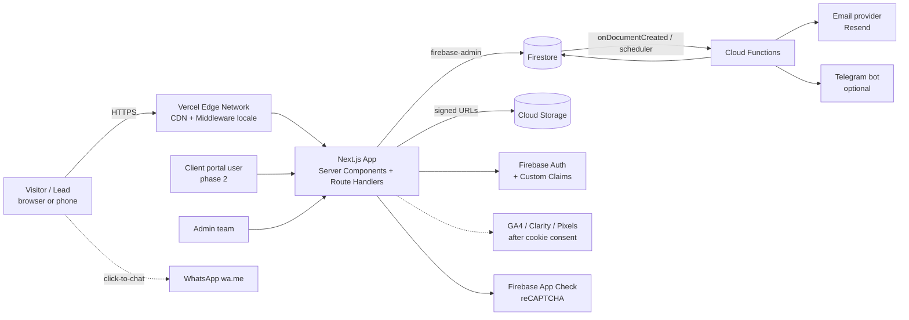
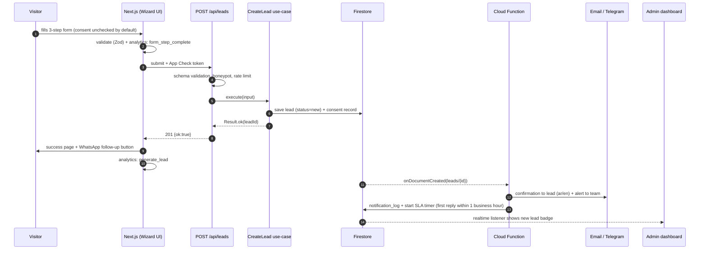
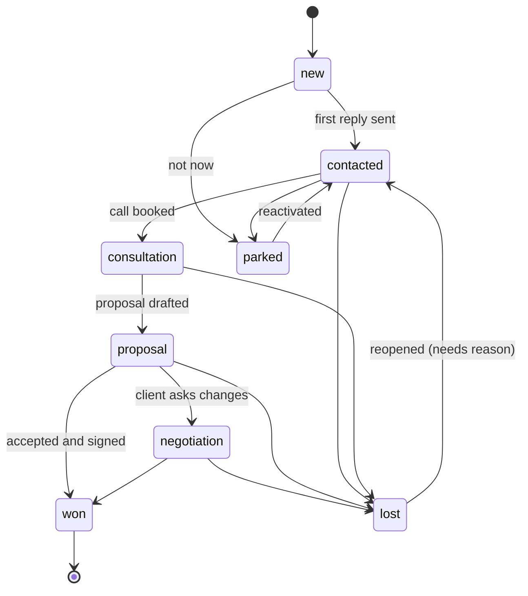
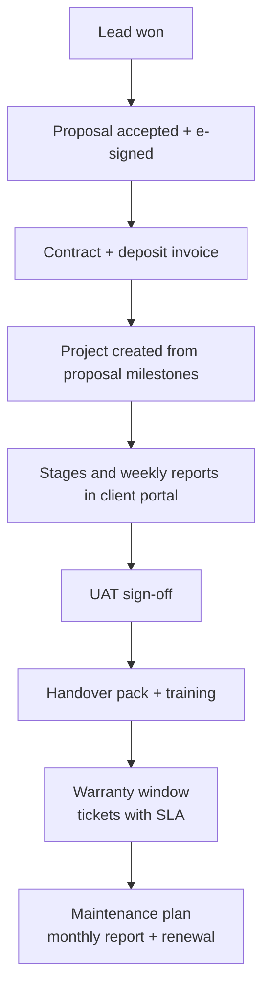
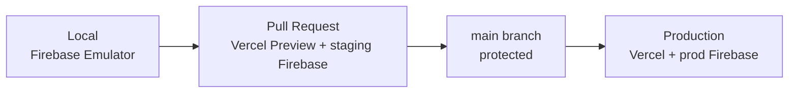

# System Design — حلول تك

## 1) الأهداف والقيود

| البند | القيمة |
|---|---|
| الهدف الأساسي | موقع تسويقي يجذب عملاء ويحوّلهم لطلب خدمة أو استشارة، ثم يدير دورة العميل: استشارة، بروبوزل، عمل، دعم |
| المستخدمون | زائر / عميل محتمل (عام)، عميل (بوابة، المرحلة 2)، فريق الأدمن (owner, agent) |
| اللغات | عربي (افتراضي ومرجعي) + إنجليزي |
| الحجم المتوقع | آلاف قليلة من الزيارات شهرياً في البداية، عشرات إلى مئات العملاء المحتملين شهرياً. لا حاجة لتعقيد توسّع كبير |
| الأولويات | سرعة الجوال، الأمان والخصوصية (PDPL)، سهولة التعديل، تكلفة تشغيل منخفضة، قابلية القياس |
| قيود | Next.js + Firebase (قرار العميل)، بدون إيموجي، بدون أسعار معلنة في الموقع |

الحمل منخفض، فالتصميم يفضّل **البساطة التشغيلية** (Serverless بالكامل) مع **حدود طبقات صارمة** تسمح بالنمو لاحقاً.

## 2) المعمارية العامة (C4 — مستوى الحاويات)

| الحاوية | المسؤولية | لماذا |
|---|---|---|
| Vercel (Edge + Node) | تقديم الصفحات، middleware اللغة والحماية، Route Handlers | سرعة وCDN عالمي، نشر معاينات لكل PR |
| Next.js | العرض (SSG/ISR للتسويقي، SSR للأدمن والبوابة) | SEO + سرعة |
| Firestore | بيانات التشغيل (leads، proposals...) | بلا خوادم، Realtime للأدمن |
| Cloud Storage | مرفقات، PDF البروبوزل، ملفات المشروع | ملفات خاصة بروابط موقّعة |
| Firebase Auth | هوية الأدمن والعميل، Custom Claims للأدوار | جاهز وآمن |
| Cloud Functions | أعمال خلفية: إشعارات، SLA، تذكيرات | منفصلة عن الواجهة، تعمل عند الأحداث |
| App Check | منع الاستخدام غير المشروع للـ API | يقلل السبام |
| مزود إيميل | رسائل تأكيد وتنبيه وتقارير | موثوقية التسليم |

## 3) تدفق الطلب (Sequence): من الزائر إلى الأدمن

## 4) دورة حياة العميل المحتمل (State Machine)

القاعدة تعيش في `lead-status.machine.ts` (domain) كجدول انتقالات مسموحة، ولا يمكن لأي طبقة تغيير الحالة خارجه. كل انتقال يسجل سطراً في `LEAD_STATUS_HISTORY` ويتطلب سبباً عند الخسارة.

## 5) من الفوز إلى الدعم (المرحلة 2)

كل مرحلة لها: صاحب مسؤولية، وتاريخ مستهدف، وإشعار تلقائي، وعدّاد SLA تراقبه Cloud Function مجدولة (`sla-monitor`).

## 6) الأمان والخصوصية

| الطبقة | الإجراء |
|---|---|
| الحدود | Zod على كل طلب، حدود الأحجام، Honeypot، App Check، Rate limit (IP + جوال) |
| الهوية | Firebase Auth. الأدمن: Custom Claim `role`. العميل: رابط سحري أو OTP، ويقرأ فقط ما يخصه (`clientId == auth.uid`) |
| الصلاحيات | Firestore Rules "رفض افتراضي" + تحقق إضافي في الخادم (دفاع مزدوج). مصفوفة كاملة في `02-erd-and-firestore-mapping.md` |
| الملفات | Storage خاص، روابط موقّعة قصيرة العمر، قائمة أنواع بيضاء، حد 10MB |
| الأسرار | Vercel/Firebase Secrets، مفاتيح منفصلة لكل بيئة |
| PDPL | موافقة صريحة غير محددة مسبقاً مسجلة في `CONSENT` بنسخة السياسة، عدم تحميل Pixels قبل الموافقة، سياسة احتفاظ (مثلاً حذف العملاء المحتملين غير النشطين بعد 24 شهراً بقرار قانوني)، مسار طلب حذف |
| الرؤوس | CSP، HSTS، Referrer-Policy، Permissions-Policy |
| التدقيق | سجل `LEAD_STATUS_HISTORY`، و`NOTIFICATION_LOG`، وسجلات Cloud Functions |

**ملاحظة إقامة البيانات:** Firebase/Vercel خارج المملكة بشكل افتراضي. لو عميل حكومي أو مؤسسي يشترط إقامة البيانات داخل السعودية، يُبنى له نشر منفصل على سحابة محلية (قرار تجاري يُدوَّن في ADR ويُراجع قانونياً).

## 7) القابلية للمراقبة (Observability)

| ماذا | أين |
|---|---|
| أخطاء الواجهة والخادم | Vercel Logs + Sentry (موصى به) |
| أداء حقيقي (Web Vitals) | Vercel Analytics أو GA4 (RUM) |
| الدوال الخلفية | Cloud Logging + تنبيه عند فشل متكرر |
| تسليم الإيميل | `NOTIFICATION_LOG` + لوحة المزود |
| سلامة الخدمة | `/api/health` + Uptime check (فحص خارجي كل دقيقة) |
| نتائج الأعمال | لوحة التحاليل في الأدمن + GA4 (انظر `05-analytics-and-growth`) |

## 8) التوسع والأداء

- الصفحات التسويقية ثابتة (SSG/ISR) على CDN، فلا تتأثر بالحمل.
- الكتابة الوحيدة الحساسة هي إنشاء `leads`، وFirestore يتحمل أضعاف ما نحتاجه.
- فهارس Firestore مطلوبة لاستعلامات الأدمن (حالة + تاريخ، مسؤول + حالة، خدمة + تاريخ) في `firestore.indexes.json`.
- التقارير الثقيلة (تحاليل الأدمن) تُحسب بتجميعات مجدولة ليلاً في مستند `stats/daily-*` بدل مسح كل المستندات عند كل فتح.
- لو تعدت الحاجة حدود Firestore للتحليل، نصدّر لـ BigQuery (Extension جاهز) بدون تغيير الواجهة.

## 9) الاعتماد والتعافي

| الخطر | التخفيف |
|---|---|
| فشل إيميل التأكيد | إعادة محاولة تلقائية + قناة بديلة (Telegram) + زر واتساب دائماً متاح للعميل |
| فشل Firestore لحظياً | الواجهة تعرض رسالة واضحة وتعرض زر واتساب كبديل فوري، ولا تفقد بيانات الفورم (حفظ مؤقت في المتصفح) |
| تسريب مفتاح | تدوير المفاتيح، أسرار منفصلة لكل بيئة، `gitleaks` في CI |
| فقدان بيانات | نسخ احتياطي مجدول لـ Firestore (يومي) إلى Storage منفصل، واختبار استرجاع ربع سنوي |
| سبام | App Check + Rate limit + Honeypot + قائمة حظر |

## 10) البيئات والنشر

- ثلاث بيئات Firebase منفصلة (`dev`, `staging`, `prod`)، ولا بيانات حقيقية خارج `prod`.
- النشر: GitHub Actions: `lint, types, tests, rules tests, lighthouse` ثم Vercel، و`firebase deploy --only firestore:rules,functions` من نفس الخط.
- التراجع: Vercel Instant Rollback، وإصدارات Functions.

## 11) قرارات تصميمية مختصرة

| القرار | السبب | البديل المرفوض |
|---|---|---|
| Serverless كامل | حمل منخفض، تكلفة وصيانة أقل | خادم VPS (صيانة دائمة) |
| Firestore بدل SQL | Realtime للأدمن، لا خوادم، بيانات مستندية بسيطة | Postgres (أقوى للتقارير، أعقد تشغيلاً الآن) |
| ISR للصفحات التسويقية | سرعة قصوى وSEO | SSR لكل طلب (أبطأ وأغلى) |
| Ports & Adapters | نتحرر من Firebase إن لزم، اختبارات سريعة | استدعاء Firebase داخل المكونات |
| لا أسعار معلنة | قرار تجاري، التأهيل عبر سؤال الميزانية الاختياري | باقات معلنة (تُجرّب لاحقاً بـ A/B لو أسباب الخسارة بالسعر) |
